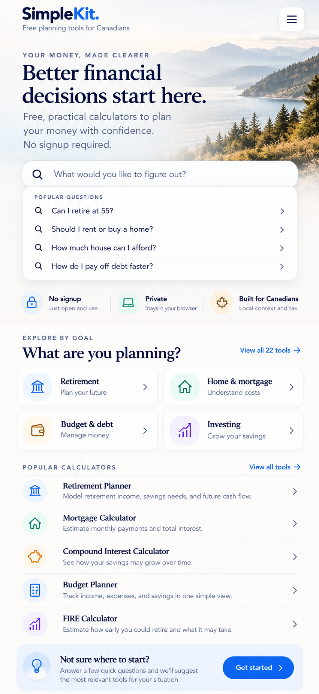

# SimpleKit v2 phased redesign implementation plan

Prepared: 2026-10-09. Repository: `ashleysnl/simplekit-site`.

This is an execution roadmap, not an implementation or release approval. All new tasks start incomplete. Implement one phase at a time through a feature branch and reviewed PR, preserving all 22 calculators, their URLs, and production until the owner explicitly approves release.

## Task state convention

| State | Meaning | Transition rule |
| --- | --- | --- |
| `[ ]` | Incomplete | Default for every new task and acceptance check. |
| `[~]` | In progress | Work has actually begun; record the branch/PR and remaining work. |
| `[x]` | Complete | Acceptance criteria passed and evidence is linked. |

Use literal `- [~]` for work in progress; GitHub may display it as text rather than a native checkbox. A blocked task stays `[ ]` or `[~]` with a written blocker. Do not mark implementation complete because this plan or its reference image was committed. Phase status becomes complete only after every task and acceptance check passes.

## Persistent visual target



[Open the original design target](design-reference/simplekit-v2-target.png). This is the unchanged user-uploaded `image.png` recovered from the referenced “Premium design proposal” chat (original environment path `/mnt/data/image.png`). It is 851 × 1848 pixels; SHA-256: `3a3dda8eacc4d1795643e6be4672a51d5310133529366f158e45cae2df97ad23`.

Keep this original file stable for comparisons during every phase. Commit production hero imagery and icons separately; do not render the whole mockup as the website or use its embedded text as imagery. Record intentional visual deviations, their reason, and owner decisions in the phase evidence. The image establishes mobile visual hierarchy; desktop arrangements, exact font families, spacing values, and interaction states must be designed and verified rather than assumed to exist in the reference.

### Design requirements observed in the reference

- White/off-white background, deep navy headings, bright blue links/buttons, muted slate supporting text, subtle borders/shadows and generous spacing.
- “SimpleKit.” wordmark with blue “Kit.”; tagline “Free planning tools for Canadians”; rounded hamburger control.
- A misty coastal mountain/lake or inlet landscape fading behind live text: eyebrow “YOUR MONEY, MADE CLEARER”, headline “Better financial decisions start here.” and “Free, practical calculators to plan your money with confidence. No signup required.”
- Rounded search field: “What would you like to figure out?”; a separate white “POPULAR QUESTIONS” panel with four question rows and chevrons.
- Three trust items: “No signup / Just open and use”, “Private / Stays in your browser”, “Built for Canadians / Local context and tax”. Verify those claims before shipping (Phase 4).
- “EXPLORE BY GOAL / What are you planning?” with Retirement, Home & mortgage, Budget & debt, Investing cards and “View all 22 tools”.
- “POPULAR CALCULATORS” with Retirement Planner, Mortgage Calculator, Compound Interest Calculator, Budget Planner and FIRE Calculator in that order.
- Pale blue “Not sure where to start?” panel, short guidance copy and a blue “Get started” button.
- Serif display headings and calculator names, sans-serif interface/body text, consistent outlined icons in pastel circular backgrounds. The image uses two goal columns; use one on narrow screens if necessary for readable labels and usable controls.

## Repository contracts and boundaries

Baseline inspected: `main` commit `ca7826db75cb4353488786aab80857b3a71c1be1`. Recheck the latest approved baseline when implementation begins.

| Source or workflow | Codex guidance |
| --- | --- |
| `templates/index.html`, `templates/tools/index.html` | Edit authored landing-page templates. Use `{{toolUrl:tool-slug}}` and `{{toolCount}}`; do not hardcode canonical tool URLs in templates. |
| `assets/site.css`, new homepage assets/modules | Scope v2 styles under a homepage class or component namespace. Shared CSS changes require checking every consumer. |
| `data/tools.json` | Authoritative 22-tool names, slugs, canonical paths/URLs and legacy subdomains. Derive discovery metadata from these IDs and validate coverage. |
| `assets/tool-registry.js` and generated registries | Inspect generation before editing; use canonical registry contracts, do not create a second route authority. |
| `data/calculator-sources.json` | Pinned calculator/Core GitHub sources. Leave revisions unchanged throughout this redesign unless separately reviewed and explicitly authorized. |
| Calculator route directories and `.cache/calculator-sources/` | Existing calculator logic comes from independent repositories. Do not patch copied calculator code or downloaded caches to implement the homepage. |
| `scripts/build-site.mjs` | Produces ignored `dist/`; documentation is excluded. Keep this plan and original mockup under `docs/`, out of public deployment output. |
| `tests/browser-smoke.cjs` | Current optional Playwright test accepts local preview only, checks all tool routes/Core, and verifies mortgage recalculation. Add homepage behavior coverage; do not claim existing smoke covers every calculator computation. |
| `.github/workflows/validate.yml` | PR validation builds/tests/validates artifacts and checks tracked files remain unchanged. It does not deploy. |
| `.github/workflows/cloudflare-preview.yml` | Manual workflow with `source_ref`; dedicated `simplekit-preview` project and `codex-preview` deployment branch; production branch guard `__production_disabled__`, no custom domains. |

See [README](../README.md), [Cloud development](../CLOUD_DEVELOPMENT.md), [cloud validation evidence](cloud-native-validation.md), [SEO migration](../SEO-MIGRATION.md), and [Core shell migration](../CORE-SHELL-MIGRATION.md). Cloud-development setup statements reflect an earlier task. The prior chat reports a successful preview workflow and browser verification; treat that as historical evidence, not verification of the future v2 build. Do not recreate existing preview infrastructure without checking it.

Non-negotiable boundaries:

1. Preserve calculator formulas, defaults, storage/export/import behavior, source pins and public routes. Keep existing `/tools/` compatibility pages, legacy redirects, guides, privacy/methodology/support links, and sitemap inventory.
2. Keep production root pages, `CNAME`, GitHub Pages publishing configuration, DNS, Cloudflare production settings and deployed commit untouched during implementation/preview phases. Do not copy `dist/` over checked-in root pages.
3. No automatic merge, production deploy, hosting migration, account requirement or remote collection of search/onboarding answers. Explicit production approval must identify the exact commit/artifact and deployment destination.
4. Existing canonical navigation may point to `simplekit.app` even in previews. Distinguish canonical-link verification from exercising a calculator in the preview: open its canonical **path** on the preview origin. Never mistake a successful production navigation for a preview test.

## Execution protocol for every phase

Read this plan, repository instructions, relevant source files and the target PNG before changing code. Confirm prerequisite phases and start from the latest reviewed work. Continue on a dedicated implementation feature branch (for example `feature/simplekit-v2`), or use focused phase PRs; do not edit `main` directly. A documentation-plan PR does not authorize implementation or release.

Set only the active phase/task to `[~]`. Implement its bounded scope. Reuse the current static HTML/CSS/JavaScript architecture unless a separate decision is approved. Capture before/after screenshots at 375, 390, 768 and 1440 CSS pixels; check 320 and 1920 widths, portrait/landscape and zoom. Compare section order, typography, landscape fade/crop, spacing, colors and controls with the reference; document differences.

For code phases run the current supported validation sequence with the Node version in `.node-version`:

```sh
npm run sources:fetch
npm test
npm run build
npm run seo:validate
npm run output:validate
npm run preview
```

Use the isolated Playwright setup documented in `docs/cloud-native-validation.md` for `tests/browser-smoke.cjs`. Do not add runtime dependencies just to run browser checks. Run focused interaction checks appropriate to the phase. Build must leave tracked files unchanged apart from intentional authored changes; do not commit `dist/` or `.cache/`.

Record evidence in a phase PR and a future `docs/v2/phase-NN-verification.md`: source commit, task states, files changed, commands/results, browser/device scope, screenshot paths, comparison notes, route checks, known limitations, and preview workflow/deployment links if used. Add evidence links to this plan. Mark `[x]` only after the criteria pass; report blockers without checking them off. Obtain review of the finished phase before proceeding to the next phase when working through the roadmap step by step.

Reusable Codex execution prompt:

> Implement Phase NN only from `docs/SIMPLEKIT_V2_REDESIGN_PLAN.md` on a feature branch. Read `docs/design-reference/simplekit-v2-target.png` and the repository instructions first. Confirm prerequisites, set active tasks to `[~]`, implement the phase using existing source/template/registry contracts, and run its acceptance checks and the supported build validations. Preserve all 22 calculators, existing URLs, source pins, production files/configuration and deployment. Record screenshots, results, limitations and evidence links; set passing tasks to `[x]`. Open or update a focused PR and report the next incomplete task. Do not merge or deploy production.

## Phase 0 — Baseline inventory and regression guardrails

Status: `[x]`. Baseline tasks and acceptance checks passed. Owner instructed proceeding to Phase 1 on 2026-10-09; this clears the execution pause without representing a GitHub review or production release approval.

- [x] Reinspect the latest approved commit, repository instructions, templates, registry generation, CSS consumers, source pins and hosting workflows; record baseline SHAs.
- [x] Capture the current homepage, header/menu, directory and representative tool screenshots; save route/link inventories and deterministic tool input/output fixtures.
- [x] Record all 22 tools from the inventory below, all existing site/sitemap URLs, compatibility routes and configured legacy redirect destinations. Confirm the currently documented 53 sitemap URLs against actual manifests/output.
- [x] Establish the current build, SEO/output validation and browser-smoke results; document existing failures separately from v2 regressions.
- [x] Record production deployment identity/configuration through permitted read-only evidence and preserve the previous deployment/artifact for later comparison and rollback.

Acceptance:

- [x] Inventory contains exactly 22 unique tool IDs and unchanged canonical paths; every route returns the expected working page in local output.
- [x] Baseline fixture evidence exists for Retirement Planner demo, Budget Planner recalculation, mortgage principal/payment, and one meaningful input/output or checklist/planner interaction for every remaining tool.
- [x] A reproducible baseline build and artifact inventory are saved with any unresolved blocker; no new code is started with unexplained baseline failures.

Codex guidance: start with manifests/build outputs rather than assuming the checked-in root is the new deployment artifact. Add meaningful preservation checks that compare the baseline contracts and pinned calculator assets, not tests that merely mirror HTML styling. Evidence: [Phase 0 verification](v2/phase-00-verification.md), including 22 runtime fixtures, 28 screenshots, complete route/artifact inventories, 49 configured redirects, preserved production artifact and read-only hosting evidence. Branch: `feature/simplekit-v2-phase-0`. Live edge requests return HTTP 403 from this environment; configuration/deployment identity and downloaded artifact are verified separately.

## Phase 1 — Design tokens, typography and assets

Status: `[x]`. Technical acceptance passed. Owner instructed Phase 2 on 2026-10-09, accepting the proposed foundations/coastal asset for implementation; no GitHub review or production release permission is implied.

- [x] Define documented CSS tokens for navy/blue/slate neutrals, blue/teal/amber/purple category accents, type scale, spacing, radii, shadows, borders, content widths, focus rings and responsive breakpoints.
- [x] Select licensed serif/sans-serif fonts matching the reference hierarchy; document source/license, fallback stacks, limited weights and loading strategy.
- [x] Create or source an approved coastal hero with no baked-in text, responsive AVIF/WebP variants and fallback; document provenance and focal point. Keep the original mockup unchanged.
- [x] Create a consistent local SVG icon set for search/menu/chevrons, trust items, goals, calculator rows and onboarding; define decorative versus labelled usage.
- [x] Add component foundations scoped to v2 and asset dimensions; document asset filenames, fonts and token usage for subsequent phases.

Acceptance:

- [x] Tokens cover every v2 component; contrast checks meet 4.5:1 for normal text, 3:1 for large text and required non-text controls.
- [x] Fonts have valid licenses, readable system fallbacks and no invisible text period; no external font request is required to use the page.
- [x] Hero variants have declared dimensions/aspect ratio, mobile and desktop crops, no embedded UI text and a largest initial mobile variant budget of 250 KB; icons render crisply at normal and 2× density.
- [x] Original reference hash is unchanged; production assets are separate; generated `dist/` excludes `docs/` and the reference PNG.

Codex guidance: prefer existing code/vector assets for UI icons. If an image generation skill is used, read its instructions and the saved reference first. Record chosen token/font values as implementation decisions, not values measured precisely from the mockup. Evidence: [Phase 1 verification](v2/phase-01-verification.md). [PR #8](https://github.com/ashleysnl/simplekit-site/pull/8), branch `feature/simplekit-v2-phase-1`; four licensed local fonts, scoped tokens/primitives, 18 SVG icons and 12 validated image variants. Technical checks pass; owner instructed proceeding to Phase 2.

## Phase 2 — Responsive header and coastal hero

Status: `[~]`. Implementation and available automated checks complete. Owner instructed Phase 3 on 2026-10-09, clearing the phase review pause; the two recorded manual browser/assistive-technology checks remain for Phase 8.

- [x] Implement the live wordmark/tagline, semantic header/navigation, mobile hamburger and desktop navigation retaining Home, Tools, Learn, About and Support destinations.
- [x] Implement menu open/close, `aria-expanded`, accessible name, Escape dismissal, logical focus return and outside-click behavior; if modal, contain focus while open.
- [x] Build the reference eyebrow/headline/body copy over the coastal fade and reserve the search region for Phase 3.
- [x] Adapt layout/crop/type sizes for mobile, tablet and desktop with a maximum content width and fluid gutters; preserve footer and existing trust/support destinations.

Acceptance:

- [~] At 320–1920 px there is no horizontal page overflow, clipped headline or overlap; text stays readable over every crop and navigation remains usable at 200% zoom. Automated CSS magnification/reflow passes; manual browser toolbar zoom coverage remains for Phase 8.
- [~] All retained navigation destinations resolve; mobile menu is operable with keyboard, touch and screen reader, closes on Escape and restores focus. Keyboard, touch and Chromium accessibility-tree checks pass; manual VoiceOver/NVDA coverage remains for Phase 8.
- [x] Heading structure has one meaningful H1 and no image-based text; hero stays stable during image/font loading and has an appropriate decorative or descriptive alternative.
- [x] Screenshots at required widths show the target hierarchy, coastal fade and wordmark treatment; desktop adaptation and any deviations are documented.

Codex guidance: change `templates/index.html` and scoped assets, leaving root `index.html` untouched during preview work. Avoid changing pinned Core as part of a homepage header; separately scope shared-shell modernization if needed. Evidence: [Phase 2 verification](v2/phase-02-verification.md), [PR #9](https://github.com/ashleysnl/simplekit-site/pull/9). Branch `feature/simplekit-v2-phase-2`; 27 responsive widths, keyboard/touch/Chromium accessibility-tree checks, loading/fallback and magnification/reflow checks pass. All 22 calculator fixtures and preservation guards pass; no merge or deploy.

## Phase 3 — Interactive search and suggested questions

Status: `[~]`. Implementation and available automated checks pass; feature PR review and manual screen-reader coverage remain. Owner instructed Phase 3 on 2026-10-09; Phase 2 manual coverage remains recorded for Phase 8.

- [x] Build a labelled search input and local discovery index covering all 22 manifest tool IDs, names, descriptions, goal tags and common synonyms. Validate IDs/routes against the canonical manifest at build/test time.
- [x] Rank exact names first, then keyword/synonym/intent matches; normalize case, whitespace and punctuation. Escape user input; render it as text, never executable HTML.
- [x] Show popular questions on empty input, matching results while typing, result count/status, a clear/reset action and useful no-result state with a real “View all tools” link.
- [x] Implement keyboard behavior with a documented interaction pattern: ordinary focusable results, or a fully implemented accessible combobox (arrows, Enter, Escape and announced active result).
- [x] Provide static tool/question links when JavaScript is unavailable; keep queries on-device and do not send them to analytics, logs or an AI service.

Question mappings (use tool tokens/registry IDs; do not invent routes):

| Reference question | Primary destination | Optional related tool |
| --- | --- | --- |
| Can I retire at 55? | `retirement-planner` | `fire-calculator` |
| Should I rent or buy a home? | `rent-vs-buy-calculator` | `mortgage-calculator` |
| How much house can I afford? | `house-affordability-calculator` | `debt-to-income-ratio-calculator` |
| How do I pay off debt faster? | `debt-payoff-calculator` | `credit-card-interest-calculator` |

Acceptance:

- [x] Exact name/slug queries find each of the 22 tools; `retire at 55`, `rent or buy`, `afford a house`, `pay debt`, and `RRSP TFSA` return their intended tools near the top.
- [x] Empty, mixed-case, whitespace-only, punctuation, zero-match and HTML-like input work without errors or injection; clearing restores popular questions.
- [x] All four suggested questions and every result link use the correct manifest route; results update within 100 ms on the documented representative test device with 22 entries.
- [~] Keyboard/screen-reader checks pass for the selected interaction pattern; disabled JavaScript preserves direct discovery links; no query text leaves the browser. Keyboard, Chromium accessibility-tree, fallback and privacy checks pass; manual VoiceOver/NVDA coverage remains for Phase 8.

Codex guidance: local deterministic matching is sufficient; “intelligent” discovery does not require a backend or conversational financial advice. Test real ranking outcomes and stale/unknown IDs. Canonical links may leave the preview origin; test preview tool behavior separately. Evidence: [Phase 3 verification](v2/phase-03-verification.md), [PR #10](https://github.com/ashleysnl/simplekit-site/pull/10), branch `feature/simplekit-v2-phase-3`. 23 repository tests, all 22 calculator fixtures, 44 exact name/slug browser searches and required intent queries pass. Maximum search update 39 ms (next animation frame 39.5 ms), with no search network requests or analytics/storage/console changes. The curated reference prompts are labelled “Suggested questions”; all mappings use canonical IDs. No merge or deploy.

## Phase 4 — Trust indicators and honest privacy copy

Status: `[ ]`. Depends on Phases 1–3.

- [ ] Implement the three reference trust indicators with local icons, separators and readable responsive wrapping.
- [ ] Verify no-signup use for every linked calculator; audit search/onboarding, local persistence, calculator behavior and existing analytics before adopting “Private / Stays in your browser”.
- [ ] Keep calculator inputs and discovery answers local; qualify privacy copy to distinguish calculation data from existing usage analytics, and link existing privacy/methodology information.
- [ ] Verify Canadian context claims against tool scope; avoid implying every tool applies tax rules or offers professional advice, official endorsement, security guarantees or unverified popularity.

Acceptance:

- [ ] Trust items remain readable at 320 px and 200% zoom, with text conveying meaning independently of icons/color.
- [ ] Copy is supported by an audit and aligns with the privacy page. If analytics remains, no absolute claim that all browsing information stays local is shipped.
- [ ] A network check confirms no search strings, onboarding choices or calculator financial values are added to requests or analytics payloads by v2.

Codex guidance: preserve the target's trust layout, but truth takes precedence over mockup wording. Do not silently add/remove analytics; document any required separately reviewed change. Evidence link: pending.

## Phase 5 — Explore-by-goal navigation

Status: `[ ]`. Depends on Phases 1–4.

- [ ] Implement the four goal cards in reference order, with matching icon/accent/name/description and accessible full-card links.
- [ ] Map each goal to an existing directory section or deterministic filtered directory state; define stable anchors/query handling without renaming existing routes.
- [ ] Ensure every tool has at least one documented discovery category. Surface tax, travel, pay and contractor tools through the complete directory/secondary groupings rather than hiding them because the mockup has only four goals.
- [ ] Generate “View all 22 tools” from `{{toolCount}}`; preserve the unfiltered `/tools/` directory and a reset/all-tools option.

Acceptance:

- [ ] Retirement, Home & mortgage, Budget & debt, and Investing open the expected populated directory view; direct/back/reload links preserve their intended state.
- [ ] The full directory contains all 22 tools, reachable without search or onboarding, with no duplicates or missing canonical destinations.
- [ ] Cards use one column at narrow widths when needed and the reference two-column treatment where space permits; each link target is at least 44 × 44 CSS px.

Codex guidance: modify authored directory templates alongside the homepage if filtering/anchors need support. Keep categories as discovery metadata tied to manifest IDs, not a competing route list. Evidence link: pending.

## Phase 6 — Popular calculators

Status: `[ ]`. Depends on Phase 5.

- [ ] Implement the five reference rows in order: Retirement Planner, Mortgage Calculator, Compound Interest Calculator, Budget Planner, FIRE Calculator.
- [ ] Add concise factual descriptions, matching icons and chevrons, subtle row dividers and accessible link/focus states.
- [ ] Keep “View all tools” visible and use validated tool tokens for every destination.
- [ ] Establish evidence for the “Popular” label; use “Featured calculators” pending owner acceptance if no usage evidence supports popularity.

Acceptance:

- [ ] Five distinct manifest-backed tools appear in the required order, descriptions match tool behavior, and all links resolve.
- [ ] Long descriptions wrap at 320 px without hiding names/chevrons; each row has a single clear accessible link and keyboard focus indicator.
- [ ] Visual comparison confirms the reference row hierarchy and icon treatment, while all 22 tools remain available through the directory.

Codex guidance: favor semantic lists and real anchors over clickable containers. Do not add unsupported star ratings, user counts or financial outcomes. Evidence link: pending.

## Phase 7 — Guided onboarding and calculator discovery

Status: `[ ]`. Depends on Phases 3, 5 and 6.

- [ ] Implement the reference “Not sure where to start?” panel and “Get started” control, with a lightweight accessible dialog or inline step flow.
- [ ] Ask up to three optional non-sensitive questions about planning goal, immediate question and preferred level of detail; offer skip, back, close and restart.
- [ ] Document deterministic answer-to-tool mappings covering all four primary goals and secondary needs; return one to three tools with brief reasons and direct manifest links.
- [ ] Keep answers ephemeral in memory, clear them on restart/close, request no account or personal financial details, and retain an all-tools fallback with JavaScript disabled.

Acceptance:

- [ ] Every answer path, skip path and incomplete path terminates with a relevant recommendation or all-tools fallback; back/restart/close work without stale state.
- [ ] Flow supports keyboard and screen reader, announces step progress and restores focus on close; modal focus is contained when applicable.
- [ ] No answers are transmitted or persisted by default; recommendations describe tools and do not promise financial conclusions.
- [ ] Starting with retirement, housing, debt/budget or investing produces the expected documented tool IDs and working links.

Codex guidance: test the mapping table and real user paths. Keep the flow optional; users can open every calculator directly. Evidence link: pending.

## Phase 8 — Responsive polish, accessibility and performance

Status: `[ ]`. Depends on Phases 1–7; apply accessibility throughout earlier phases too.

- [ ] Audit homepage/directory/menu/search/onboarding for WCAG 2.2 AA: landmarks, headings, labels, focus order/visibility, contrast, target size, announcements and alternatives.
- [ ] Test keyboard-only use, VoiceOver/Safari and a second documented screen-reader/browser combination; test touch and 200% text enlargement/400% reflow.
- [ ] Test 320, 375, 390, 768, 1024, 1440 and 1920 widths and landscape; check Chrome, Safari, Firefox and at least one real iPhone/Android browser where available.
- [ ] Respect reduced motion, avoid hover-only controls, support image/font/JavaScript failures, and check long labels and empty/results/dialog states.
- [ ] Optimize hero loading, fonts and modules; reserve layout space, avoid blocking scripts and unnecessary dependencies.

Acceptance:

- [ ] No critical/serious automated accessibility findings remain in changed UI; manual keyboard and screen-reader paths pass. Document tool-page pre-existing issues separately and fix any v2-introduced regression.
- [ ] Page reflows at 320 CSS px/400% zoom without two-dimensional scrolling for normal content; controls retain 44 px targets as the project design goal, readable labels and visible focus.
- [ ] Three documented mobile Lighthouse lab runs achieve median performance ≥90, accessibility ≥95, LCP ≤2.5 s and CLS ≤0.1 on the same settings; record device/throttling and limitations. Do not call lab results real-user INP evidence.
- [ ] Where field data later exists, monitor p75 LCP ≤2.5 s, INP ≤200 ms and CLS ≤0.1; new interactions are responsive in local/preview tests.

Codex guidance: accessibility/performance failures are acceptance blockers, not optional polish. Report device combinations unavailable to automation without pretending they were tested. Evidence link: pending.

## Phase 9 — SEO and content integrity

Status: `[ ]`. Depends on Phase 8.

- [ ] Retain semantic copy, a single H1, meaningful section headings, useful descriptions and crawlable ordinary links to directory/tools/guides.
- [ ] Verify titles/descriptions, production canonicals, Open Graph/Twitter metadata, approved share image and valid structured data; keep existing verification tags and maintainer attribution.
- [ ] Preserve all canonical paths, sitemap/robots contracts and existing compatibility/noindex rules. Do not introduce query/filter duplicates into the sitemap.
- [ ] Validate metadata against the finished design without inventing ratings, reviews or a search schema endpoint that does not exist.

Acceptance:

- [ ] `seo:validate` and `output:validate` pass; each indexed page has one correct production canonical, matching Open Graph URL and preserved manifest sitemap membership (baseline currently 53 URLs).
- [ ] All 22 calculator paths, existing guides, compatibility pages and documented legacy redirect destinations remain intact; no new broken internal links or assets.
- [ ] Main discovery links are present with JavaScript disabled; preview indexing protections remain isolated to preview artifacts and never replace production robots policy.

Codex guidance: use the existing SEO generators and route authority. Review [SEO improvement plan](../SEO-IMPROVEMENT-PLAN.md) for context; v2 does not automatically complete its separate checklist. Evidence link: pending.

## Phase 10 — Full regression and release candidate

Status: `[ ]`. Depends on Phases 0–9.

- [ ] Run the supported commands from a clean checkout and compare repeated build inventories for deterministic output.
- [ ] Run all 22 tools on the local generated origin; verify inputs render, shared Core mounts, navigation/assets/modules load and each baseline interaction/output fixture still passes.
- [ ] Specifically rerun Retirement Planner demo, Budget Planner recalculation, mortgage principal/payment, storage reload and export/import where supported; compare with Phase 0.
- [ ] Exercise search, suggested questions, all goals, all featured rows, onboarding, no-JS fallback and compatibility routes; collect console errors and failed requests.
- [ ] Review the artifact diff: calculator logic/pins and routes unchanged, expected homepage/assets changed, no docs/mockup/cache/developer files published; preserve a versioned candidate artifact and checksum.

Acceptance:

- [ ] All existing validation and meaningful new behavior tests pass; all 22 baseline fixtures match within documented tool rounding/tolerance rules.
- [ ] Zero new browser errors, failed same-origin asset requests or broken internal links; external analytics/support checks are explicitly distinguished from stubbed tests.
- [ ] Build reproducibility and unchanged calculator logic are demonstrated; any generated wrapper differences are reviewed and explained.
- [ ] PR contains screenshot comparisons, accessibility/performance/SEO/regression evidence, candidate commit/artifact identity and known limitations; required hosted validation passes for that commit.

Codex guidance: the existing browser smoke script is a starting point, not proof of every calculation. Add fixture coverage appropriate to each tool type, and test preview paths rather than accidentally following production canonicals. Evidence link: pending.

## Phase 11 — Cloudflare preview and owner review

Status: `[ ]`. Depends on Phase 10.

- [ ] Inspect the manual preview workflow and dedicated project/environment protections through permitted tools; retain production branch guard and absence of custom domains.
- [ ] Dispatch “Manual Cloudflare preview” from the trusted default workflow with `source_ref` set to the exact reviewed feature commit; satisfy existing environment approvals without weakening protections.
- [ ] Record source SHA, workflow URL, artifact checksum and exact deployment URL from upload output; verify the shared branch alias points to that candidate.
- [ ] Verify deployed homepage, discovery flows and all 22 calculator paths/assets on the preview origin; compare the deployed file inventory with the approved artifact and rerun key calculator interactions.
- [ ] Present mobile/tablet/desktop comparisons with the saved mockup, verification evidence and deviations for owner design/release review; resolve feedback on the feature branch.

Acceptance:

- [ ] Build/upload jobs succeed for the intended candidate and the deployed artifact matches; deployed pages return `X-Robots-Tag: noindex, nofollow`, preview robots disallows crawling, and the preview has no production `CNAME`.
- [ ] All 22 calculators and every new interaction pass on the preview origin; no new console errors/failed same-origin requests/broken links.
- [ ] Production content/deployed commit and publishing/DNS/custom-domain configuration remain unchanged against the recorded baseline.
- [ ] Owner review outcome is documented against the exact commit and deployment. Design acceptance and permission to release production are recorded separately.

Codex guidance: the prior verified alias was `https://codex-preview.simplekit-preview.pages.dev`; `https://simplekit-preview.pages.dev` returned 404 because only a preview branch was uploaded. Use upload output as the current authority. The `codex-preview` alias is shared/replaceable: coordinate preview uploads and retain the immutable candidate URL. Preview approval never grants production approval. Evidence link: pending.

## Phase 12 — Controlled production rollout and rollback

Status: `[ ]`. Depends on Phase 11 plus explicit owner production approval.

- [ ] Prepare the concrete release package: exact source commit/artifact/checksum, all passing checks, preview approval, intended existing production destination, deploy procedure, previous artifact/commit and rollback procedure.
- [ ] Inspect the actual GitHub Pages publishing source and Cloudflare configuration. If publishing `dist/` needs a workflow, create a separate reviewed proposal with protected approvals; do not assume merging templates deploys the new site.
- [ ] Obtain explicit owner approval for that exact release and any necessary merge/publishing action; any change to commit/artifact/destination invalidates that release approval and requires renewed review.
- [ ] Merge only as approved, rebuild/verify if commit identity changes, then deploy the reviewed artifact through the approved protected workflow to the existing production destination. Hosting migration/DNS changes require separate authorization.
- [ ] Check production homepage/discovery, all 22 calculator routes, canonical/sitemap/robots policy, key input/output fixtures, assets and legacy redirects immediately after rollout.
- [ ] Monitor at rollout, about 24 hours and 7 days using existing authorized monitoring/analytics; document errors, navigation/conversion signals and available performance data without collecting private query/answer values. Schedule new automation only if requested.
- [ ] Roll back through the approved procedure if a canonical calculator is unavailable, calculation fixture regresses, key navigation fails, or a severe accessibility/asset/JavaScript issue appears; reverify routes and record incident evidence.

Acceptance:

- [ ] Approval evidence names the final deployed commit/artifact/destination; required checks pass, a previous working artifact is available, and rollback commands/permissions are verified before release.
- [ ] Production serves the approved v2 candidate, all 22 calculators/URLs and existing redirects work, and production indexing remains correct without preview `noindex` headers.
- [ ] Monitoring/rollback evidence is recorded; no unapproved production configuration or DNS changes occur. Close the rollout phase only after its observation checks pass.

Codex guidance: this phase is an approval gate. Complete the reviewable release preparation first, then stop before unauthorized merge/deploy. Existing documentation explicitly keeps merge and production deployment separate. A plan commit, feature PR, passing CI or preview acceptance is not release permission. Evidence link: pending.

## Protected calculator inventory

Snapshot from `data/tools.json` at the inspected baseline. All canonical URLs use `https://simplekit.app` plus the path below. Preserve legacy subdomain values from the manifest and existing redirect behavior; do not repoint them in this project. During every phase verify all 22 remain discoverable; Phase 0/10/11/12 verify runtime behavior on the relevant origin.

| # | Tool | Canonical path / ID |
| --- | --- | --- |
| 1 | Retirement Planner | `/retirement-planner/` |
| 2 | FIRE Calculator | `/fire-calculator/` |
| 3 | CPP Calculator | `/cpp-calculator/` |
| 4 | RRSP / TFSA Calculator | `/rrsp-vs-tfsa-calculator/` |
| 5 | Compound Interest Calculator | `/compound-interest-calculator/` |
| 6 | Savings Goal Calculator | `/savings-goal-calculator/` |
| 7 | Emergency Fund Calculator | `/emergency-fund-calculator/` |
| 8 | Net Worth Calculator | `/net-worth-calculator/` |
| 9 | Budget Planner | `/budget-planner/` |
| 10 | Canadian Take Home Pay Calculator | `/take-home-pay-calculator/` |
| 11 | Debt Payoff Calculator | `/debt-payoff-calculator/` |
| 12 | Credit Card Interest Calculator | `/credit-card-interest-calculator/` |
| 13 | Loan Calculator | `/loan-calculator/` |
| 14 | House Affordability Calculator | `/house-affordability-calculator/` |
| 15 | Rent vs Buy Calculator | `/rent-vs-buy-calculator/` |
| 16 | Mortgage Paydown vs Invest | `/mortgage-paydown-vs-invest-calculator/` |
| 17 | Investment Fee Calculator | `/investment-fee-calculator/` |
| 18 | Mortgage Calculator | `/mortgage-calculator/` |
| 19 | Canadian Tax Checklist | `/canadian-tax-checklist/` |
| 20 | Travel Planner | `/travel-planner/` |
| 21 | Debt-to-Income Ratio Calculator | `/debt-to-income-ratio-calculator/` |
| 22 | Contractor Effective Hourly Rate Calculator | `/contractor-effective-hourly-rate-calculator/` |

## Phase tracker and handoff

| Phase | State | Evidence / next step |
| --- | --- | --- |
| 0 Baseline and guardrails | `[x]` | [Baseline evidence](v2/phase-00-verification.md); owner instructed Phase 1. Live edge HTTP checks limited by 403. |
| 1 Tokens and assets | `[x]` | [Foundation evidence](v2/phase-01-verification.md); owner instructed Phase 2. |
| 2 Header and hero | `[~]` | [Header/hero evidence](v2/phase-02-verification.md), [PR #9](https://github.com/ashleysnl/simplekit-site/pull/9); implementation complete; owner instructed Phase 3, manual coverage pending. |
| 3 Search and questions | `[~]` | [Search evidence](v2/phase-03-verification.md), [PR #10](https://github.com/ashleysnl/simplekit-site/pull/10); implementation/automated checks pass, PR review/manual AT coverage pending. |
| 4 Trust indicators | `[ ]` | Pending Phase 3. |
| 5 Goal navigation | `[ ]` | Pending Phase 4. |
| 6 Popular calculators | `[ ]` | Pending Phase 5. |
| 7 Guided onboarding | `[ ]` | Pending Phases 3, 5, 6. |
| 8 Accessibility/responsiveness/performance | `[ ]` | Pending Phase 7. |
| 9 SEO/content integrity | `[ ]` | Pending Phase 8. |
| 10 Full regression/candidate | `[ ]` | Pending Phase 9. |
| 11 Cloudflare preview/review | `[ ]` | Pending Phase 10. |
| 12 Production rollout | `[ ]` | Pending Phase 11 and explicit release approval. |

End each execution with the active phase, completed criteria/evidence, unfinished work or blocker, current branch/PR/commit, preview identity if applicable, production unchanged status, and the next bounded phase/task. Keep this file updated in the same phase PR so the next Codex task can resume from evidence instead of conversation memory.
